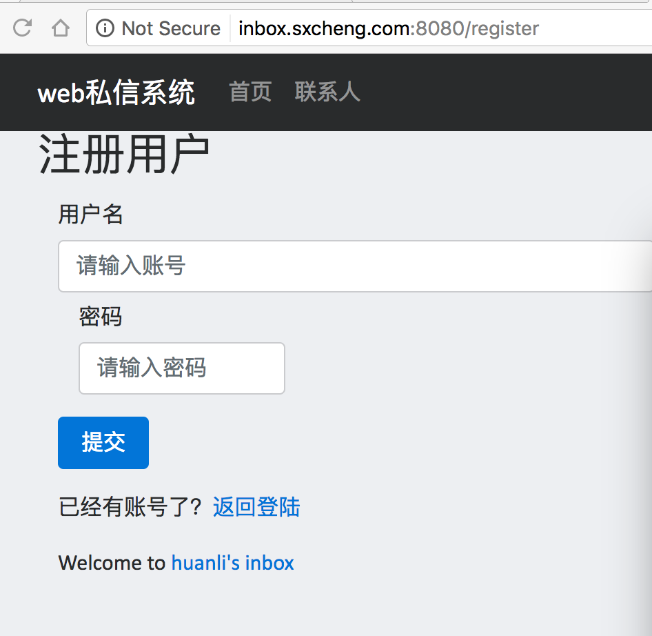
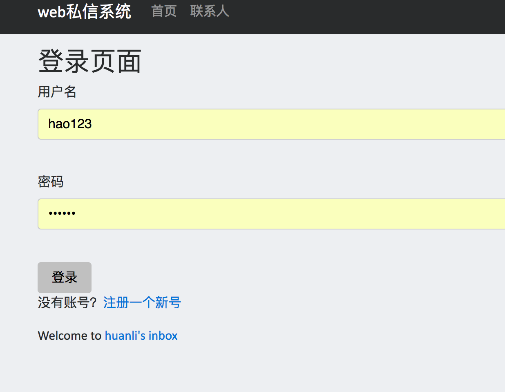

# Web私信系统

### 使用技术
web前端：Spring Thymleaf + bootrap
Web后端：Spring boot(Spring MVC) + Spring Security
数据库： Mysql 

## 程序结构：
### 数据库脚本：
* https://github.com/huanli2/web-inbox/blob/master/inbox/src/main/resources/schema.sql
### 业务逻辑处理：
* https://github.com/huanli2/web-inbox/tree/master/inbox/src/main/java/lih/services

## 功能描述
### 注册
用户名(username)唯一标识用户，只保存用户的username和password信息。
password密文存储，存储方式为：sha-1加密密码明文 + salt

### 登陆与授权管理
Spring Security

### 联系人
  联系人列表
  
  搜索用户   -- done
  添加联系人 -- 如果A和B互相不为联系人，A添加B，B是A的联系人，A不是B的联系人    -- done
  删除联系人 -- 如果A和B互为联系人，A删除B，B从A的联系人列表删除，A还在B的联系人列表中  -- done

聊天
  进入聊天页面  -- 未读置为0   -- done
  发送消息  -- done
  聊天历史 -- 不考虑历史消息长度问题，历史滑动初始位置不是最新记录 -- done 

未完成：
参数验证、错误处理、认证后直接调用接口联系人重复添加

实时刷新未读消息、实时刷新联系人、实时消息接收

注册完自动登录：
https://github.com/hellokoding/registration-login-spring-hsql/blob/master/src/main/java/com/hellokoding/auth/service/SecurityServiceImpl.java

参考资料：
https://www.gitbook.com/book/waylau/spring-security-tutorial/details
https://github.com/waylau/spring-security-tutorial
https://docs.spring.io/spring-boot/docs/current/reference/htmlsingle/#boot-features-sql
https://docs.spring.io/spring-security/site/docs/current/reference/htmlsingle/#tech-intro-authentication