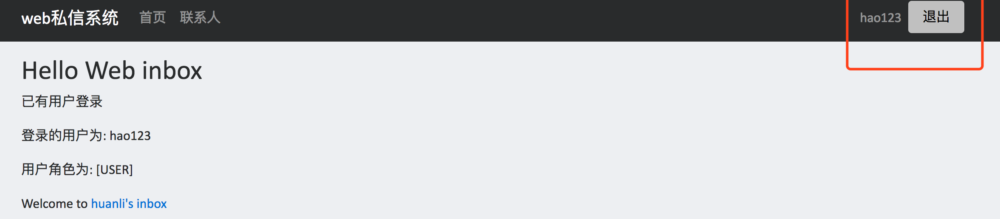
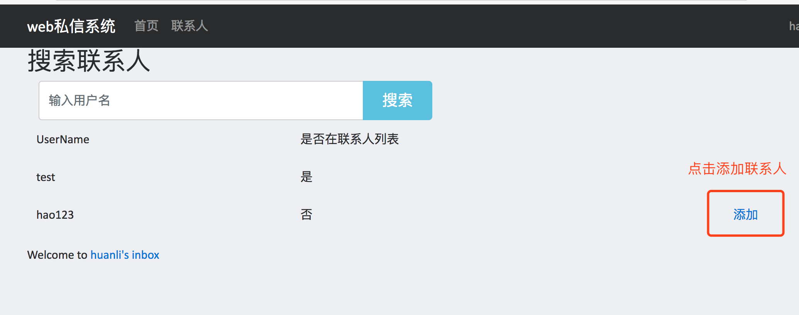

# Web私信系统

### 使用技术
* web前端：Spring Thymleaf + bootsrap
* Web后端：Spring boot(Spring MVC) + Spring Security
* 数据库： Mysql 

## 程序结构
### 数据库脚本：
* https://github.com/huanli2/web-inbox/blob/master/inbox/src/main/resources/schema.sql
### 业务逻辑处理：
* https://github.com/huanli2/web-inbox/tree/master/inbox/src/main/java/lih/services

## 功能描述
### 注册
* 用户名(username)唯一标识用户，只保存用户的username和password信息。
* 密码使用密文存储，存储方式为：sha-1加密密码明文 + salt

### 登陆、登出与授权管理
* 使用Spring Security管理
** 登录后跳转到联系人页面

### 联系人
 * 联系人列表，展示联系人姓名、未读消息数
 ** 点击最右侧的“删除该联系人”可将该用户从你的联系人列表中删除
 *** 删除联系人：如果A和B互为联系人，A删除B，B从A的联系人列表删除，A还在B的联系人列表中
 ** 点击查找用户进入搜索用户页面
 ** 点击用户名进入聊天页面
 

 * 搜索用户，根据输入模糊匹配查找联系人，如果查找到的用户不在你的联系人列表，最右侧可点击“添加”链接添加该联系人
 ** 添加联系人：如果A和B互相不为联系人，A添加B，B是A的联系人，A不是B的联系人
 

### 聊天
 * 聊天页面，进入聊天页面后，与该联系人的未读消息数自动变为0
 * A给B发送消息，A的消息历史自动刷新，B需要主动刷新。
 * 待优化功能点：聊天历史比较长时，进入聊天页面后，需要手动滑动滚动条才能到最新的一条消息；并且未做历史消息的分页处理，只是简单暴力查找所有聊天记录。
 

### 待优化：
* 参数验证
* 错误处理
* 接口对联系人和用户检查
* 实时刷新未读消息、实时刷新联系人、实时消息接收

注册完自动登录：
* https://github.com/hellokoding/registration-login-spring-hsql/blob/master/src/main/java/com/hellokoding/auth/service/SecurityServiceImpl.java

参考资料：
* https://www.gitbook.com/book/waylau/spring-security-tutorial/details
* https://github.com/waylau/spring-security-tutorial
* https://docs.spring.io/spring-boot/docs/current/reference/htmlsingle/#boot-features-sql
* https://docs.spring.io/spring-security/site/docs/current/reference/htmlsingle/#tech-intro-authentication